## Presentation

A sample of 226 elderly people living in Bordeaux (Gironde, South-West France)
were interviewed in 2000 for a nutritional study.


## Export your dataset 

First, you should export the data from the .csv file:

- top right panel from Rstudio: Import Data set
- Name the data set as for example "nutri"
- Save Nutri in a RData file using the command line

```r
save(Nutri,file="data_nutrition.RData")
```

I did it for you. So if you failed you still have the RData file _data_nutrition.RData_ stored in the ANALYSIS folder containing the R project

## Read the dataset stored in a .RData file

**Warning:** You should save your .RData file in the same folder as your report document (.Rmd)


```r
load("data_nutrition.RData")
```
Here my data frame is called **nutri** 


```r
head(nutri)
```

```
# A tibble: 6 x 13
  gender situation   tea coffee height weight   age  meat  fish raw_fruit
   <int>     <int> <int>  <int>  <int>  <int> <int> <int> <int>     <int>
1      2         1     0      0    151     58    72     4     3         1
2      2         1     1      1    162     60    68     5     2         5
3      2         1     0      4    162     75    78     3     1         5
4      2         1     0      0    154     45    91     0     4         4
5      2         1     2      1    154     50    65     5     3         5
6      2         1     2      0    159     66    82     4     2         5
# ... with 3 more variables: cooked_fruit_veg <int>, chocol <int>,
#   fat <int>
```

Check the structure of your data:


```r
str(nutri)
```

```
Classes 'tbl_df', 'tbl' and 'data.frame':	226 obs. of  13 variables:
 $ gender          : int  2 2 2 2 2 2 2 2 2 2 ...
 $ situation       : int  1 1 1 1 1 1 1 1 1 1 ...
 $ tea             : int  0 1 0 0 2 2 2 0 0 0 ...
 $ coffee          : int  0 1 4 0 1 0 0 2 3 2 ...
 $ height          : int  151 162 162 154 154 159 160 163 154 160 ...
 $ weight          : int  58 60 75 45 50 66 66 66 60 77 ...
 $ age             : int  72 68 78 91 65 82 74 73 89 87 ...
 $ meat            : int  4 5 3 0 5 4 3 4 4 2 ...
 $ fish            : int  3 2 1 4 3 2 3 2 3 3 ...
 $ raw_fruit       : int  1 5 5 4 5 5 5 5 5 5 ...
 $ cooked_fruit_veg: int  4 5 2 0 5 5 5 5 5 4 ...
 $ chocol          : int  5 1 5 3 3 1 5 1 5 0 ...
 $ fat             : int  6 4 4 2 2 3 6 6 6 3 ...
 - attr(*, "spec")=List of 2
  ..$ cols   :List of 13
  .. ..$ gender          : list()
  .. .. ..- attr(*, "class")= chr  "collector_integer" "collector"
  .. ..$ situation       : list()
  .. .. ..- attr(*, "class")= chr  "collector_integer" "collector"
  .. ..$ tea             : list()
  .. .. ..- attr(*, "class")= chr  "collector_integer" "collector"
  .. ..$ coffee          : list()
  .. .. ..- attr(*, "class")= chr  "collector_integer" "collector"
  .. ..$ height          : list()
  .. .. ..- attr(*, "class")= chr  "collector_integer" "collector"
  .. ..$ weight          : list()
  .. .. ..- attr(*, "class")= chr  "collector_integer" "collector"
  .. ..$ age             : list()
  .. .. ..- attr(*, "class")= chr  "collector_integer" "collector"
  .. ..$ meat            : list()
  .. .. ..- attr(*, "class")= chr  "collector_integer" "collector"
  .. ..$ fish            : list()
  .. .. ..- attr(*, "class")= chr  "collector_integer" "collector"
  .. ..$ raw_fruit       : list()
  .. .. ..- attr(*, "class")= chr  "collector_integer" "collector"
  .. ..$ cooked_fruit_veg: list()
  .. .. ..- attr(*, "class")= chr  "collector_integer" "collector"
  .. ..$ chocol          : list()
  .. .. ..- attr(*, "class")= chr  "collector_integer" "collector"
  .. ..$ fat             : list()
  .. .. ..- attr(*, "class")= chr  "collector_integer" "collector"
  ..$ default: list()
  .. ..- attr(*, "class")= chr  "collector_guess" "collector"
  ..- attr(*, "class")= chr "col_spec"
```

As you can see all variables are considered as integer variable. Then we should structure well our variables as for example the mean of variable ``fat'' make any sense.


```r
mean(nutri$fat)
```

```
[1] 3.814159
```

Check the meaning of the variables from the http://www.biostatisticien.eu/springeR/jeuxDonnees4.html


## Structuring variables according to type

We first structure the following qualitative variable:

- qualitative variable (``_nominale_''): gender, situation and fat

```r
nutri$gender <- as.factor(nutri$gender)
levels(nutri$gender) <- c("Male","Female")
nutri$situation <- as.factor(nutri$situation)
levels(nutri$situation) <- c("single","couple","family","other")
nutri$fat <- as.factor(nutri$fat)
levels(nutri$fat) <- c("butter","margarine","peanut",
 "sunflower","olive","Isio4","rapeseed","duck")
```

- Ordinal variables meat (``_ordinale_''): fish, raw fruit, cooked fruit veg and chocol


```r
nutri$meat <- as.ordered(nutri$meat)
nutri$fish <- as.ordered(nutri$fish)
nutri$raw_fruit <- as.ordered(nutri$raw_fruit)
nutri$cooked_fruit_veg <- as.ordered(nutri$cooked_fruit_veg)
nutri$chocol <- as.ordered(nutri$chocol)
mylevels <- c("never","<1/week.","1/week.","2-3/week.","4-6/week.","1/day")
levels(nutri$chocol) <- levels(nutri$cooked_fruit_veg) <- levels(nutri$raw_fruit) <- mylevels
levels(nutri$fish) <- levels(nutri$meat) <- mylevels
```


Now we structure the following quantitative variable:

- Discrete quantitative variables: tea and coffee


```r
nutri$tea <- as.integer(nutri$tea)
nutri$coffee <- as.integer(nutri$coffee)
```

- Continuous quantitative variables: height, weight and age


```r
nutri$height <- as.double(nutri$height)
nutri$weight <- as.double(nutri$weight)
nutri$age <- as.double(nutri$age)
```

## Check if the Data frame is well structure


```r
str(nutri)
```

```
Classes 'tbl_df', 'tbl' and 'data.frame':	226 obs. of  13 variables:
 $ gender          : Factor w/ 2 levels "Male","Female": 2 2 2 2 2 2 2 2 2 2 ...
 $ situation       : Factor w/ 4 levels "single","couple",..: 1 1 1 1 1 1 1 1 1 1 ...
 $ tea             : int  0 1 0 0 2 2 2 0 0 0 ...
 $ coffee          : int  0 1 4 0 1 0 0 2 3 2 ...
 $ height          : num  151 162 162 154 154 159 160 163 154 160 ...
 $ weight          : num  58 60 75 45 50 66 66 66 60 77 ...
 $ age             : num  72 68 78 91 65 82 74 73 89 87 ...
 $ meat            : Ord.factor w/ 6 levels "never"<"<1/week."<..: 5 6 4 1 6 5 4 5 5 3 ...
 $ fish            : Ord.factor w/ 6 levels "never"<"<1/week."<..: 4 3 2 5 4 3 4 3 4 4 ...
 $ raw_fruit       : Ord.factor w/ 6 levels "never"<"<1/week."<..: 2 6 6 5 6 6 6 6 6 6 ...
 $ cooked_fruit_veg: Ord.factor w/ 6 levels "never"<"<1/week."<..: 5 6 3 1 6 6 6 6 6 5 ...
 $ chocol          : Ord.factor w/ 6 levels "never"<"<1/week."<..: 6 2 6 4 4 2 6 2 6 1 ...
 $ fat             : Factor w/ 8 levels "butter","margarine",..: 6 4 4 2 2 3 6 6 6 3 ...
 - attr(*, "spec")=List of 2
  ..$ cols   :List of 13
  .. ..$ gender          : list()
  .. .. ..- attr(*, "class")= chr  "collector_integer" "collector"
  .. ..$ situation       : list()
  .. .. ..- attr(*, "class")= chr  "collector_integer" "collector"
  .. ..$ tea             : list()
  .. .. ..- attr(*, "class")= chr  "collector_integer" "collector"
  .. ..$ coffee          : list()
  .. .. ..- attr(*, "class")= chr  "collector_integer" "collector"
  .. ..$ height          : list()
  .. .. ..- attr(*, "class")= chr  "collector_integer" "collector"
  .. ..$ weight          : list()
  .. .. ..- attr(*, "class")= chr  "collector_integer" "collector"
  .. ..$ age             : list()
  .. .. ..- attr(*, "class")= chr  "collector_integer" "collector"
  .. ..$ meat            : list()
  .. .. ..- attr(*, "class")= chr  "collector_integer" "collector"
  .. ..$ fish            : list()
  .. .. ..- attr(*, "class")= chr  "collector_integer" "collector"
  .. ..$ raw_fruit       : list()
  .. .. ..- attr(*, "class")= chr  "collector_integer" "collector"
  .. ..$ cooked_fruit_veg: list()
  .. .. ..- attr(*, "class")= chr  "collector_integer" "collector"
  .. ..$ chocol          : list()
  .. .. ..- attr(*, "class")= chr  "collector_integer" "collector"
  .. ..$ fat             : list()
  .. .. ..- attr(*, "class")= chr  "collector_integer" "collector"
  ..$ default: list()
  .. ..- attr(*, "class")= chr  "collector_guess" "collector"
  ..- attr(*, "class")= chr "col_spec"
```

You can save it into a new RData file, for example _nutri_struct.RData_


```r
save(nutri,file="nutri_struct.RData")
```

So the next time you want to work on it you just need to load the file as 

```r
load("nutri_struct.RData")
```

## USE THE attach()  function

The function attach()  gives direct access to the variables
(columns) of a data.frame, by typing the name of a variable


```r
attach(nutri)
```

```
The following objects are masked from nutri (pos = 3):

    age, chocol, coffee, cooked_fruit_veg, fat, fish, gender,
    height, meat, raw_fruit, situation, tea, weight
```

```
The following objects are masked from nutri (pos = 5):

    age, chocol, coffee, cooked_fruit_veg, fat, fish, gender,
    height, meat, raw_fruit, situation, tea, weight
```

```r
##Show the gender of the first five subjects
gender[1:5]
```

```
[1] Female Female Female Female Female
Levels: Male Female
```

## Tables of counts and frequency tables


```r
tc <- table(fat) # Table of counts.
tc
```

```
fat
   butter margarine    peanut sunflower     olive     Isio4  rapeseed 
       15        27        48        68        40        23         1 
     duck 
        4 
```


```r
tf <- tc/length(fat) # Frequency table.
tf
```

```
fat
     butter   margarine      peanut   sunflower       olive       Isio4 
0.066371681 0.119469027 0.212389381 0.300884956 0.176991150 0.101769912 
   rapeseed        duck 
0.004424779 0.017699115 
```

## Tables of grouped data

It is sometimes interesting to represent a table of individual data (or raw data table), of one or several quantitative variables, in a more condensed form. To this end, use a table of grouped data, giving the count (or frequency) of predefined classes.

Note that you can use the function hist() and specify the boundaries of classes in the argument breaks; it will then return the count in each of these classes. The default value of the argument breaks is "Sturges", which automatically calculates the classes.


```r
res <- hist(height,plot=FALSE)
table(cut(height,res$breaks,include.lowest=TRUE))
```

```

[140,145] (145,150] (150,155] (155,160] (160,165] (165,170] (170,175] 
        1         7        37        50        46        31        27 
(175,180] (180,185] (185,190] 
       17         4         6 
```


## Contingency tables

When given a table of individual data, you can use the function table() to get the observed contingency table for a couple (X; Y).


```r
mytable <- table(gender,situation)
mytable
```

```
        situation
gender   single couple family other
  Male       20     63      2     0
  Female     78     56      7     0
```

To add margins to this table, use the function addmargins().


```r
table.complete <- addmargins(mytable,FUN=sum,quiet=TRUE)
table.complete
```

```
        situation
gender   single couple family other sum
  Male       20     63      2     0  85
  Female     78     56      7     0 141
  sum        98    119      9     0 226
```


# Numerical summaries

- Modes: the modes of variable X are the values that occur most frequently

```r
tabtea <- table(tea)
names(which.max(tabtea))
```

```
[1] "0"
```

- Mean, Median, quartiles, Min and Max


```r
summary(height)
```

```
   Min. 1st Qu.  Median    Mean 3rd Qu.    Max. 
    140     157     163     164     170     188 
```

```r
summary(weight)
```

```
   Min. 1st Qu.  Median    Mean 3rd Qu.    Max. 
  38.00   57.25   66.00   66.48   75.00   96.00 
```

```r
summary(age)
```

```
   Min. 1st Qu.  Median    Mean 3rd Qu.    Max. 
  65.00   70.00   74.00   74.48   78.00   91.00 
```

But as you have well structured your data frame if you use summary on a qualitative variable you get:


```r
summary(situation)
```

```
single couple family  other 
    98    119      9      0 
```

## Measures of association between two quantitative variables


```r
cor(height,weight)
```

```
[1] 0.6306576
```

# Graphical representations

## Plotting qualitative variables

A bar charts is produced by using:


```r
col <- c("gray","orangered","lightgoldenrodyellow","red")
barplot(table(situation),col=col)
```

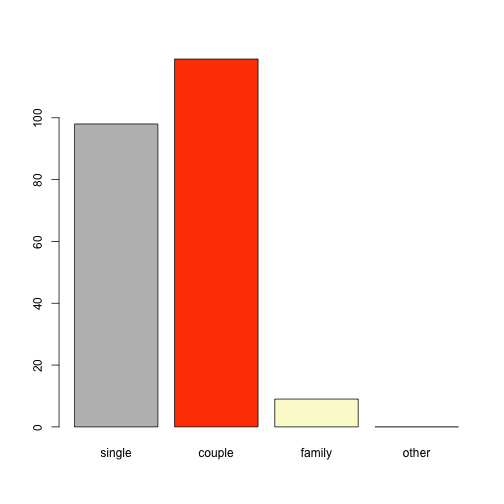


or using just the plot function 

```r
col <- c("gray","orangered","lightgoldenrodyellow","red")
plot(situation,col=col)
```


## Pareto chart

A Pareto chart can also be produced with the function barplot(), since it is a bar chart with bars ordered from tallest to smallest.


```r
col <- c("yellow","yellow2","sandybrown","orange", "darkolivegreen","green","olivedrab2","green4")
barplot(sort(table(fat),T),col=col)
```

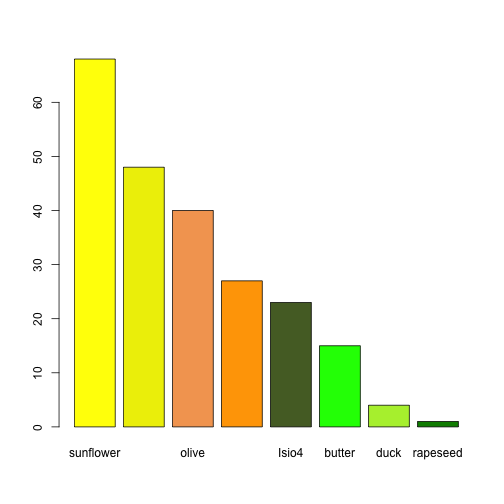

## Plotting quantitative variables

### Boxplot


```r
boxplot(height,col="orange", main="Boxplot for variable weight")
```

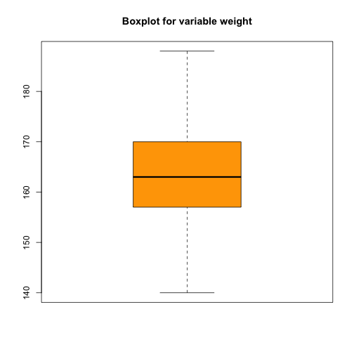


### Histogram


```r
hist(age,breaks=10,col="green")
```

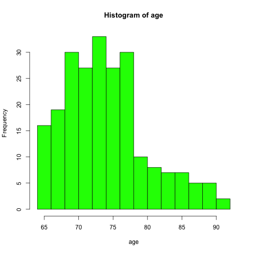


## Graphical representations in a bivariate setting

## Two-way plots for two qualitative variables


```r
tss <- prop.table(table(gender,situation),1)
barplot(tss,bes=T,leg=T)
title(paste("Barplots of situation","as a function of gender", sep="nn"))
```

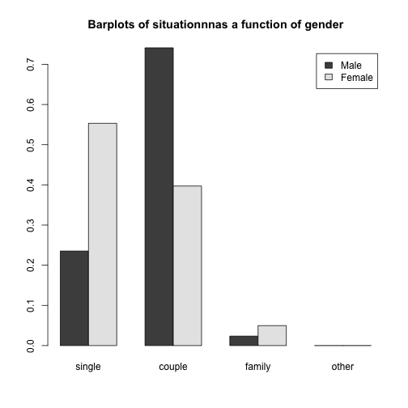

A mosaic plot can also be useful to visualize the relationship between two qualitative variables.


```r
par(las=1) # Horizontal writing of levels.
mosaicplot(gender~fat,color=1:8, main="Mosaicplot of fat as a function of age")
```

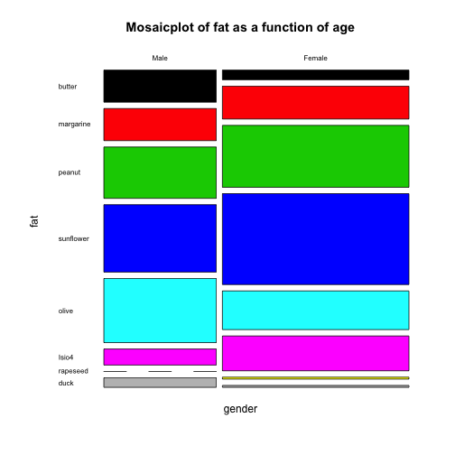

## Two-way plots for two quantitative variables


```r
plot(height~weight)
```

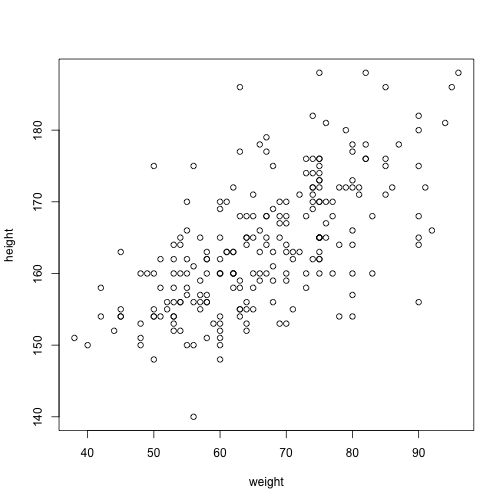

## Two-way plots for one qualitative and one quantitative variable


```r
par(bty="n")
plot(coffee~gender,col=2:3,notch=T,varwidth=T,boxwex=0.3)
title(paste("Boxplot of coffee consumption as a function of gender",sep="nn"),family="Courier")
```

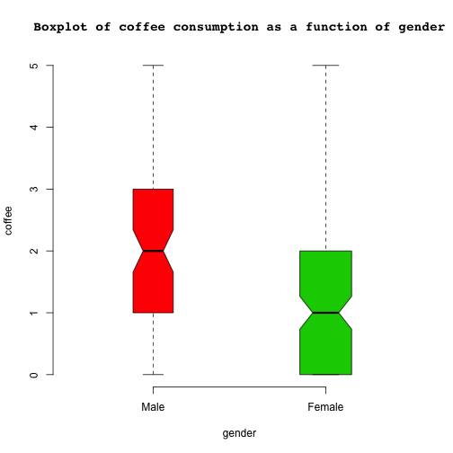


### Density estimation 

- smooth estimation 

```r
plot(density(age))
```

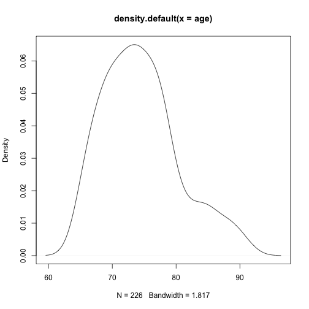

- add histogram


```r
plot(density(age),add=TRUE)
```

```
Warning in plot.window(...): "add" is not a graphical parameter
```

```
Warning in plot.xy(xy, type, ...): "add" is not a graphical parameter
```

```
Warning in axis(side = side, at = at, labels = labels, ...): "add" is not a
graphical parameter

Warning in axis(side = side, at = at, labels = labels, ...): "add" is not a
graphical parameter
```

```
Warning in box(...): "add" is not a graphical parameter
```

```
Warning in title(...): "add" is not a graphical parameter
```

```r
hist(age,breaks=10,col="green",prob=TRUE,add=TRUE)
```

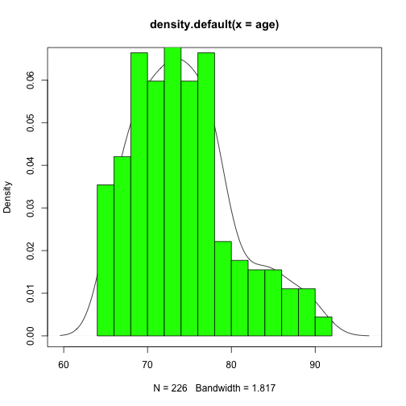


### Check Normality 

Sometimes it is required to check Normality assumption:

- Visual  


```r
library(lattice)
qqnorm(age)
qqline(age)
```

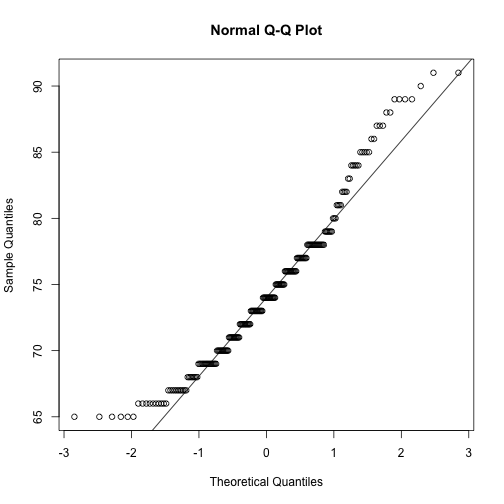

Sounds not normal. For a normal process you shold get something like 


```r
fakedata <- rnorm(5000,mean=4,sd=1)
qqnorm(fakedata)
qqline(fakedata)
```

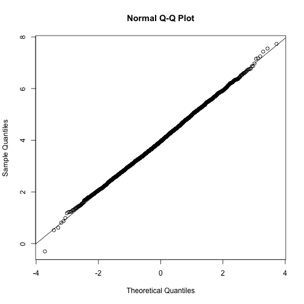


- Hypothesis test 

You can use shapiro-wilk test for normality 


```r
shapiro.test(age)
```

```

	Shapiro-Wilk normality test

data:  age
W = 0.95471, p-value = 0.000001508
```

So it is not normal ... but for our fake data 


```r
shapiro.test(fakedata)
```

```

	Shapiro-Wilk normality test

data:  fakedata
W = 0.99948, p-value = 0.191
```

We cannot reject null hypothesis "data come from Normal distribution", so we can assume that our assumption is not violated 


