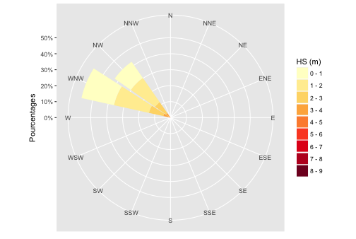
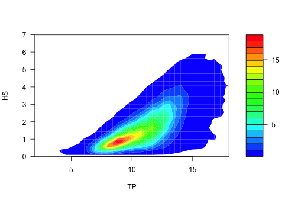

# Houle

## Analyse descriptive


- Rose des houles: How to do with R ?


```r
source("Rose_houles.r")
library(data.table)
load("DATASET/Data_wind_Anglet.RData")
a <- seq(from=0,to=round(max(data.wind.anglet$HS)),length=round(max(data.wind.anglet$HS)+1))
plot.swellrose(spd = data.wind.anglet$HS,dir = data.wind.anglet$PEAKD ,spdseq = a)
```



- Representation bivariee




## Analyse serie temporelle


```r
recons <- as.data.frame(test1$Tend)
par(new=T)
plot(test1$Data.vec,type="l",ylab="Hs(m)",xlab="Year",axes=F,main="")
axis(2)
axis(1,at=seq(1,792,12),labels=as.character(1949:2014))
lines(recons,col="red",lwd=2)
legend("topleft",legend=c("Série temporelle originale","Tendance"),col=c("black","red"),lty=1,cex=0.8)
```


```r
boxplot(test1$Sais.matrix,pch=1,xlab="Mois",ylab="Hs(m)",main="",ylim=range(test1$Sais.matrix),names=as.character(c("J","F","M","A","M","J","J","A","S","O","N","D")))
abline(h=1,lty=2)
monthplot(x.ts,type="h",ylab="Hs(m)")
```


## Etude des extrêmes


```r
source("Selection_cor.R")
library(fExtremes)
library(ismev)
library(QRM)
source("gumrlvalue_maxi.R")
source("gum_rl_ic.R")
library(scales)
maxim<-maxi(data.wind.anglet)
gum.rl.ic(maxim$mle,maxim$cov,maxim$data,.7)
invisible(ks.test(maxim$data,"pGumbel",maxim$mle[1],maxim$mle[2]))
u <- 4.5
data.t <- selection.cor(data.wind.anglet,u)
bootp <- read.csv("DATASET/bootpAnglet_1949_2014.site")[,-1]
k <- (mean(data.t$hs-u)^2/var(data.t$hs-u)-1)/2

o <- mean(data.t$hs-u)*(mean(data.t$hs-u)^2/var(data.t$hs-u)+1)/2
lambdat<-length(data.t$hs)/65
  
t <- c(round(seq(from=0.1,to=9,length=10),1),ceiling(seq(from=10,to=150,length=22)))
xmv <- u+(o/k)*((t*lambdat)^k-1)
  
biais <- apply(bootp,2,mean)-xmv
  
qp <- data.frame((apply(bootp,2,quantile,(1-0.7)/2)-biais),xmv,(apply(bootp,2,quantile,1-(1-0.7)/2)-biais))
t <- c(round(seq(from=0.1,to=9,length=10),1),ceiling(seq(from=10,to=150,length=22)))
plot(t,qp$xmv,log="x",type="n", xlab = "Période de retour (annees)", ylab = "Hauteur significative (metres)", 
       main = "")
lines(t,qp$xmv)
lines(t,qp[,1])
lines(t,qp[,3])
n <- length(data.wind.anglet$HS)
lambdat <-length(data.t$hs)/65
points((1/(1 - (1:n)/(n + 1))/lambdat)[match(data.t$hs,data.wind.anglet$HS)],sort(data.t$hs),pch=16,cex=0.7,col="blue")
abline(v=c(1,5,10,50,100),lty=2,col=alpha("grey",0.9))
invisible(ks.test(data.t$hs,"pgpd",k,u,o))
```


