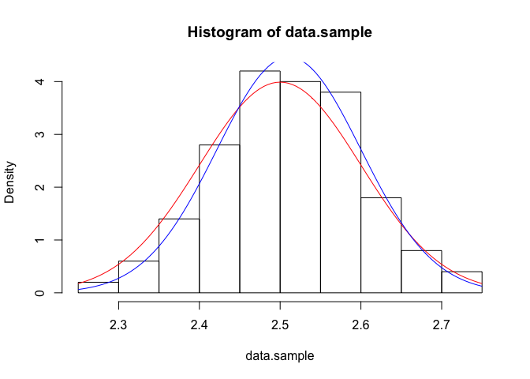

Parametric estimation density
-----------------------------

Generate a data set from Normal density
=======================================

    set.seed(1)
    n <- 100
    data.sample <- rnorm(n,mean=2.5,sd=0.1)

Write the likelihood function
=============================

    like.norm <- function(mean,sd,data) -sum(log(dnorm(data,mean=mean,sd=sd)))

Maximum likelihood estimation
=============================

    library(stats4)
    res <- mle(like.norm,start=list(mean=median(data.sample),sd=IQR(data.sample)),fixed=list(data=data.sample))
    summary(res)

    ## Maximum likelihood estimation
    ## 
    ## Call:
    ## mle(minuslogl = like.norm, start = list(mean = median(data.sample), 
    ##     sd = IQR(data.sample)), fixed = list(data = data.sample))
    ## 
    ## Coefficients:
    ##        Estimate  Std. Error
    ## mean 2.51088911 0.008936716
    ## sd   0.08936716 0.006315383
    ## 
    ## -2 log L: -199.207

Plot the result and the true density
====================================

    hist(data.sample,prob=TRUE)
    curve(dnorm(x,mean=2.5,sd=0.1),col="red",add=TRUE)
    curve(dnorm(x,mean=res@coef[1],sd=res@coef[2]),col="blue",add=TRUE)

