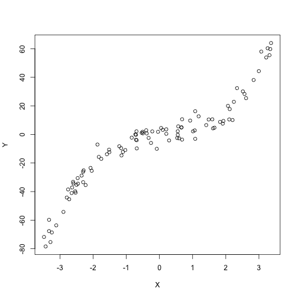
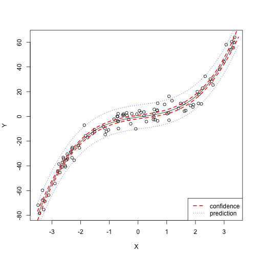

##Polynomial regression

In a polynomial model, the relationship between the explained variable $Y$ and an explanatory variable $X$ is represented in a non-linear fashion, such as:
\[Y=\beta_0+\beta_1X+\beta_2X^2+\ldots+\beta_pX^p+\epsilon.\]
This model is a multiple regression model with $p$ regressors: the powers of the explanatory variable.

To perform regression in a polynomial model, you simply need to correctly specify the formula associated with the model in the  function **lm()**. Two R functions are useful: **I()** and  **poly()**. The next table gives a few examples of formulae for polynomial models.


<table>
<thead>
<tr class="header">
<th align="left"><strong>Model</strong></th>
<th align="left"><strong>R formula</strong></th>
</tr>
</thead>
<tbody>
<tr class="odd">
<td align="left"><span class="math inline"><em>M</em><sub>1</sub></span>: <span class="math inline"><em>Y</em> = <em>β</em><sub>0</sub> + <em>β</em><sub>1</sub><em>X</em> + <em>β</em><sub>2</sub><em>X</em><sup>2</sup></span></td>
<td align="left">Y<span class="math inline">∼</span>poly(X,2,raw=TRUE)</td>
</tr>
<tr class="even">
<td align="left"><span class="math inline"><em>M</em><sub>2</sub></span>: <span class="math inline"><em>Y</em> = <em>β</em><sub>1</sub><em>X</em> + <em>β</em><sub>2</sub><em>X</em><sup>2</sup> + <em>β</em><sub>3</sub><em>X</em><sup>3</sup></span></td>
<td align="left">Y<span class="math inline">∼</span>-1+poly(X,3,raw=TRUE)</td>
</tr>
<tr class="odd">
<td align="left"><span class="math inline"><em>M</em><sub>3</sub></span>: <span class="math inline"><em>Y</em> = <em>β</em><sub>0</sub> + <em>β</em><sub>1</sub><em>X</em> + <em>β</em><sub>2</sub><em>X</em><sup>3</sup></span></td>
<td align="left">Y<span class="math inline">∼</span><code>X+I(X^3)</code></td>
</tr>
<tr class="even">
<td align="left"><span class="math inline"><em>M</em><sub>4</sub></span>: <span class="math inline"><em>Y</em> = <em>β</em><sub>1</sub><em>X</em> + <em>β</em><sub>2</sub><em>X</em><sup>3</sup> + <em>β</em><sub>3</sub><em>X</em><sup>4</sup></span></td>
<td align="left">Y<span class="math inline">∼</span><code>-1+X+I(X^3)+ I(X^4)</code></td>
</tr>
</tbody>
</table>


## Example on synthetic data

Suppose you are asked to propose a model to predict a  variable $Y$ given an explanatory variable $X$. You are given a sample of size~$n$. 


- Download the file http://biostatisticien.eu/springeR/fitpoly.RData in your current directory.


```r
load("fitpoly.RData")
attach(fitpoly)
```

```
## The following objects are masked from fitpoly (pos = 3):
## 
##     X, Y
```

- Draw a scatter plot of variable $Y$ as a function of variable $X$.


```r
plot(Y~X)
```



- Is there a linear relationship between these two variables? Fit a regression line on the previous plot.


```r
lin.model <- lm(Y~X)
summary(lin.model)
```

```
## 
## Call:
## lm(formula = Y ~ X)
## 
## Residuals:
##     Min      1Q  Median      3Q     Max 
## -27.425  -7.774   1.990   8.595  21.794 
## 
## Coefficients:
##             Estimate Std. Error t value            Pr(>|t|)    
## (Intercept)  -2.3948     1.0840  -2.209              0.0295 *  
## X            14.1570     0.5471  25.876 <0.0000000000000002 ***
## ---
## Signif. codes:  0 '***' 0.001 '**' 0.01 '*' 0.05 '.' 0.1 ' ' 1
## 
## Residual standard error: 10.76 on 98 degrees of freedom
## Multiple R-squared:  0.8723,	Adjusted R-squared:  0.871 
## F-statistic: 669.5 on 1 and 98 DF,  p-value: < 0.00000000000000022
```

```r
plot(Y~X)
abline(lin.model)
```


- Perform polynomial regression to fit the data better.


```r
poly.model <- lm(Y~poly(X,3,raw=TRUE),data=fitpoly)
summary(poly.model)
```

```
## 
## Call:
## lm(formula = Y ~ poly(X, 3, raw = TRUE), data = fitpoly)
## 
## Residuals:
##      Min       1Q   Median       3Q      Max 
## -10.1264  -3.9405  -0.4684   3.1626  11.9790 
## 
## Coefficients:
##                         Estimate Std. Error t value             Pr(>|t|)
## (Intercept)              -0.5513     0.7071  -0.780              0.43750
## poly(X, 3, raw = TRUE)1   3.2447     0.6117   5.305          0.000000723
## poly(X, 3, raw = TRUE)2  -0.4425     0.1328  -3.331              0.00123
## poly(X, 3, raw = TRUE)3   1.4694     0.0763  19.257 < 0.0000000000000002
##                            
## (Intercept)                
## poly(X, 3, raw = TRUE)1 ***
## poly(X, 3, raw = TRUE)2 ** 
## poly(X, 3, raw = TRUE)3 ***
## ---
## Signif. codes:  0 '***' 0.001 '**' 0.01 '*' 0.05 '.' 0.1 ' ' 1
## 
## Residual standard error: 4.828 on 96 degrees of freedom
## Multiple R-squared:  0.9748,	Adjusted R-squared:  0.974 
## F-statistic:  1238 on 3 and 96 DF,  p-value: < 0.00000000000000022
```

- Draw the estimated polynomial over the scatter plot. Draw the confidence curve for the mean of $Y$ for $X\in[-3.5,3.5]$. Add the prediction interval of the model for $X\in[-3.5,3.5]$.


```r
coef <- coef(poly.model)
plot(Y~X)
curve(coef[1]+coef[2]*x+coef[3]*x^2+coef[4]*x^3,add=TRUE)
x <- seq(-3.5,3.5,length=50)
pred.int <- predict(poly.model,data.frame(X=x),
                    interval="prediction")[,c("lwr","upr")]
conf.int <- predict(poly.model,data.frame(X=x),
                    interval="confidence")[,c("lwr","upr")]
matlines(x,cbind(conf.int,pred.int),lty=c(2,2,3,3),
         col=c("red","red","blue","blue"),lwd=c(2,2,1,1))
legend("bottomright",lty=c(2,3),lwd=c(2,1),
       c("confidence","prediction"),col=c("red","blue"))
```


