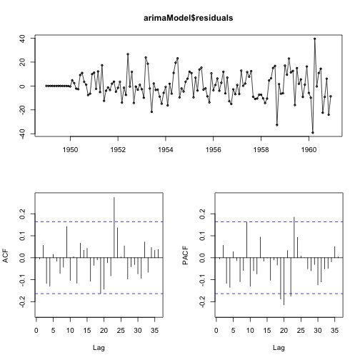

  
  
  Let's start off by loading relevant R libraries!

```r
library(tseries);library(zoo);library(forecast);library(normwhn.test)
```

The data used for this case study comes from the classic Box & Jenkins airline data that documents monthly totals of international airline passengers from 1949 to 1960. It's a great example dataset to showcase the basics of time series analysis.

It can be accessed directly in R like this:
  

```r
data('AirPassengers')
dat <- AirPassengers
```

Next, we attempt to visualize the data and decompose it into its constituents - a trend, a seasonal component and a supposedly random component, which can be either be modeled as an ARIMA(p,d,q) model or be white noise.

## Decomposing this Series

```r
plot(decompose(dat))
```


Note that the decomposition for this particular case assumes the 'period' to measure seasonality to be 12 months, mainly because this data set in R is stored as a ts object of frequency 12. One could go ahead with a custom seasonal period for series where the seasonality isn't that clear - and that can be subject matter for another blog post.

Let's have a look at the data below.


```r
print(dat)
```

```
##      Jan Feb Mar Apr May Jun Jul Aug Sep Oct Nov Dec
## 1949 112 118 132 129 121 135 148 148 136 119 104 118
## 1950 115 126 141 135 125 149 170 170 158 133 114 140
## 1951 145 150 178 163 172 178 199 199 184 162 146 166
## 1952 171 180 193 181 183 218 230 242 209 191 172 194
## 1953 196 196 236 235 229 243 264 272 237 211 180 201
## 1954 204 188 235 227 234 264 302 293 259 229 203 229
## 1955 242 233 267 269 270 315 364 347 312 274 237 278
## 1956 284 277 317 313 318 374 413 405 355 306 271 306
## 1957 315 301 356 348 355 422 465 467 404 347 305 336
## 1958 340 318 362 348 363 435 491 505 404 359 310 337
## 1959 360 342 406 396 420 472 548 559 463 407 362 405
## 1960 417 391 419 461 472 535 622 606 508 461 390 432
```

## Seasonality in the data

There are other ways of checking for seasonality in data. For example:
  

```r
boxplot(dat ~ cycle(dat))
```


This plot suggests that there is some seasonal effect. The distribution of airline passengers for the months of June through September are markedly more than that of other months.

If you're curious what the cycle function is used here, try it out!


```r
print(cycle(dat))
```

```
##      Jan Feb Mar Apr May Jun Jul Aug Sep Oct Nov Dec
## 1949   1   2   3   4   5   6   7   8   9  10  11  12
## 1950   1   2   3   4   5   6   7   8   9  10  11  12
## 1951   1   2   3   4   5   6   7   8   9  10  11  12
## 1952   1   2   3   4   5   6   7   8   9  10  11  12
## 1953   1   2   3   4   5   6   7   8   9  10  11  12
## 1954   1   2   3   4   5   6   7   8   9  10  11  12
## 1955   1   2   3   4   5   6   7   8   9  10  11  12
## 1956   1   2   3   4   5   6   7   8   9  10  11  12
## 1957   1   2   3   4   5   6   7   8   9  10  11  12
## 1958   1   2   3   4   5   6   7   8   9  10  11  12
## 1959   1   2   3   4   5   6   7   8   9  10  11  12
## 1960   1   2   3   4   5   6   7   8   9  10  11  12
```

Its job is simple. For each data point in the time series, cycle tells you the position of that particular data point in that cycle. The first candle stick in the plot above is therefore the distribution of airpassengers that corresponded to the 1st point (January) in the 12-point cycle - and so on.

Here's a plot of the seasonal component of the airlines passenger data:
  

```r
plot(decompose(dat)$seasonal,
     main = 'Seasonal Variation in Airline Passengers over Time',
     ylab = 'Seasonal Variation', col = 'black', lwd = 3)
```


## Order of Integration and Stationarity

There is an inbuilt function in R to check for the number of differences it would take to make a time series stationary. The default methods that this function uses to test for stationarity at each step of the differencing are - the Augmented Dickey-Fuller test, the Phillips-Perron unit root test and the KPSS test for stationarity.


```r
ndiffs(dat)
```

```
## [1] 1
```

It indicates that first-differencing is the way to go. And we can verify this.


```r
adf.test(dat); pp.test(dat); kpss.test(dat)
```

```
## Warning in adf.test(dat): p-value smaller than printed p-value
```

```
## 
## 	Augmented Dickey-Fuller Test
## 
## data:  dat
## Dickey-Fuller = -7.3186, Lag order = 5, p-value = 0.01
## alternative hypothesis: stationary
```

```
## Warning in pp.test(dat): p-value smaller than printed p-value
```

```
## 
## 	Phillips-Perron Unit Root Test
## 
## data:  dat
## Dickey-Fuller Z(alpha) = -46.406, Truncation lag parameter = 4,
## p-value = 0.01
## alternative hypothesis: stationary
```

```
## Warning in kpss.test(dat): p-value smaller than printed p-value
```

```
## 
## 	KPSS Test for Level Stationarity
## 
## data:  dat
## KPSS Level = 4.3423, Truncation lag parameter = 2, p-value = 0.01
```

Note that the alternative hypothesis for the ADF and PP tests is of stationarity, and for the KPSS test, the alternative hypothesis is of the presence of a unit root.

So the above results indicate the presence of a unit root (with the KPSS test), while the ADF and PP tests indicate stationarity. We therefore can't conclusively say that the series is stationary. Let's try out these same tests after differencing.

Store the differenced series in a variable and call it say, diff_dat.


```r
adf.test(diff_dat); pp.test(diff_dat); kpss.test(diff_dat)
```

```
## Warning in adf.test(diff_dat): p-value smaller than printed p-value
```

```
## 
## 	Augmented Dickey-Fuller Test
## 
## data:  diff_dat
## Dickey-Fuller = -7.0177, Lag order = 5, p-value = 0.01
## alternative hypothesis: stationary
```

```
## Warning in pp.test(diff_dat): p-value smaller than printed p-value
```

```
## 
## 	Phillips-Perron Unit Root Test
## 
## data:  diff_dat
## Dickey-Fuller Z(alpha) = -79.125, Truncation lag parameter = 4,
## p-value = 0.01
## alternative hypothesis: stationary
```

```
## Warning in kpss.test(diff_dat): p-value greater than printed p-value
```

```
## 
## 	KPSS Test for Level Stationarity
## 
## data:  diff_dat
## KPSS Level = 0.011485, Truncation lag parameter = 2, p-value = 0.1
```

...and we see that the ADF and PP tests reject the NULL of unit root while the KPSS test fails to reject the NULL of stationarity in the series. Hence we can conclude that the series doesn't have a unit root anymore, making our original series I(1). If we are to fit an ARIMA(p,d,q) model here on, we know that d = 1.

## The ARIMA Model: What are p and q?

To be sure that an ARIMA model can be fit on this data set, one has to look at the ACF and PACF charts.


```r
tsdisplay(diff_dat)
```


There are a couple of points to take from the above chart.

1. Seasonality can also be spotted in the differenced series - evident from the ACF. The pattern repeats every 12 or so lags, which means seasonality of 12 months is the way to go when deseasonalizing the differenced data before fitting an ARMA(p,q) model. Note that I say ARMA because we're dealing with an already differenced series.

2. The (differenced) series variance seems to increase with time, after around 1956. To take care of increasing error variance towards the later part of the series, we can log-transform the data - and then look at the ACF and PACF.


```r
tsdisplay(diff(log(dat)))
```


Much better!
  
  The residual series seems to have similar variance over time. However seasonality is still apparent from the ACF. We therefore need to de-seasonalzie the data before zeroing down on a possible AR order (p) from the PACF and MA order (q) from the ACF. Let's try that!


```r
tsdisplay(decompose(log(dat))$random)
```


The ACF is a slowly but surely attenuating series, perhaps with the vestiges of seasonality still present and the PACF indicates a lower order AR process. One can't simply look at the ACF and PACF and based on just looking at them pin point the order of AR and MA processes. One has to test various combinations of p and q once the ACF and PACF have made the broader picture clear - as to the range of models that might be tested for goodness of fit.

One might therefore want to test combinations of models with say, p <= 5 and q <= 10 for a good model. The way in which AIC / BIC / SBC criteria are defined account for the principle of parsimony, so it's most likely that a lower order MA ends up minimizing AIC / AICc or BIC.


```r
arimaModel <- auto.arima(dat, d = 1, max.p = 5, max.q = 10)
summary(arimaModel)
```

```
## Series: dat 
## ARIMA(0,1,1)(0,1,0)[12]                    
## 
## Coefficients:
##           ma1
##       -0.3184
## s.e.   0.0877
## 
## sigma^2 estimated as 138.3:  log likelihood=-508.32
## AIC=1020.64   AICc=1020.73   BIC=1026.39
## 
## Training set error measures:
##                     ME     RMSE      MAE        MPE     MAPE      MASE
## Training set 0.2674861 11.17471 8.279565 0.03319468 2.958284 0.2584916
##                      ACF1
## Training set -0.005541087
```

Therefore p = 2, q = 1, d = 1 and the model also has 1 seasonal difference of frequency 12.

## White Noise

The next thing to check for in the residuals - and indicator of the goodness of fit, is that the residuals are white noise. That is, if the fit model is correct, no more information can be gleaned about the underlying process.


```r
tsdisplay(arimaModel$residuals)
```



White Noise can be tested for by plotting the ACF and PACF of the residuals. Since the autocorrelations immediately die down to zero (or to put it more technically, not significantly different from zero), we can safely assume the residuals to be white noise.

## Predicting the Future

Now let's have fun and predict airline passenger-flow for the next 12 months! If you wish to take a look at the code that generated these plots, go check the RMarkdown file rendering this presentation.


```r
preds <- predict(arimaModel, n.ahead = 12)
print(preds)
```

```
## $pred
##           Jan      Feb      Mar      Apr      May      Jun      Jul
## 1961 446.7582 420.7582 448.7582 490.7582 501.7582 564.7582 651.7582
##           Aug      Sep      Oct      Nov      Dec
## 1961 635.7582 537.7582 490.7582 419.7582 461.7582
## 
## $se
##           Jan      Feb      Mar      Apr      May      Jun      Jul
## 1961 11.76104 14.23293 16.33494 18.19572 19.88312 21.43811 22.88770
##           Aug      Sep      Oct      Nov      Dec
## 1961 24.25079 25.54124 26.76955 27.94393 29.07090
```


Here's a look at the predicted series:


