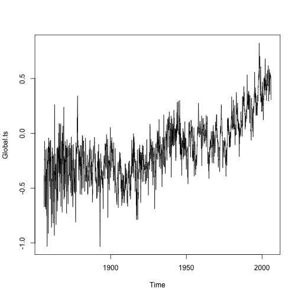
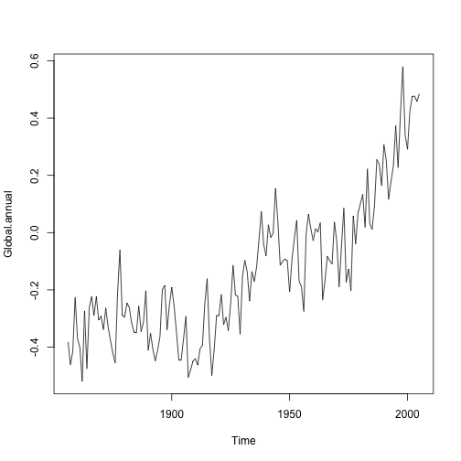

  
  
##  Context
A change in the world’s climate will have a major impact on the lives of
many people, as global warming is likely to lead to an increase in ocean levels
and natural hazards such as floods and droughts. It is likely that the world
economy will be severely affected as governments from around the globe try  
to enforce a reduction in fossil fuel use and measures are taken to deal with
any increase in natural disasters. For general policy documents and discussions on climate change, see the website
(and links) for the United Nations Framework Convention on Climate Change at
\url{http://unfccc.int}.

## Climate Change Studies
In climate change studies (e.g., see Jones and Moberg, 2003; Rayner et al.2003), the following global temperature series, expressed as anomalies from
the monthly means over the period 1961–1990, plays a central role (The data are updated regularly and can be downloaded free of charge from the Internet at: \url{http://www.cru.uea.ac.uk/cru/data/}

                                                                     
## Plot the data

```r
Global<-scan("global.dat")
Global.ts<-ts(Global, st=c(1856,1), end=c(2005,12), fr=12)
Global.annual<-aggregate(Global.ts, FUN=mean) #since we are concerned about the trend we use 'agregate'
plot(Global.ts) 
```



```r
plot(Global.annual) 
```



 
 It is the trend that is of most concern, so the aggregate function is used
to remove any seasonal effects within each year and produce an annual series
of mean temperatures for the period 1856 to 2005. We can avoid
explicitly dividing by 12 if we specify FUN=mean in the aggregate function

## Upward Trend ?
The upward trend from about 1970 onwards has been used as evidence
of global warming. In the code below, the monthly time intervals
corresponding to the 36-year period 1970–2005 are extracted using the
time function and the associated observed temperature series extracted using
window. The data are plotted and a line superimposed using a regression of
temperature on the new time index.
 

```r
#Next the momthly time intervalls for 36 years (from 1970-2005) are extracted using the 'time' FUNCTION
New.series<-window(Global.ts, start=c(1970,1), end=c(2005,12))
New.time<-time(New.series)
plot(New.series); abline(reg=lm(New.series ~ New.time)) 
```


## Question ?
In climate change studies, a vital question is whether rising
temperatures are a consequence of human activity, specifically the burning
of fossil fuels and increased greenhouse gas emissions, or are a natural trend,
perhaps part of a longer cycle, that may decrease in the future without needing
a global reduction in the use of fossil fuels. We cannot attribute the increase in
global temperature to the increasing use of fossil fuels without invoking some
physical explanation because, as we have noted, two unrelated time
series will be correlated if they both contain a trend. However, as the general
consensus among scientists is that the trend in the global temperature series is
related to a global increase in greenhouse gas emissions, it seems reasonable to
acknowledge a causal relationship and to expect the mean global temperature
to continue to rise if greenhouse gas emissions are not reduced (http://unfccc.int).

## Exercice
   - Decompose the series into the components trend, seasonal effect, and
residuals. 
   - Plot these components. Would you expect these data to have
a substantial seasonal component? 
   - Compare the standard deviation of
the original series with the deseasonalised series. 
   - Produce a plot of the trend with a superimposed seasonal effect.
   - Plot the correlogram of the residuals (random component) from part
   - Comment on the plot, with particular reference to any statistically
significant correlations.
