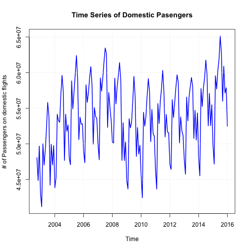
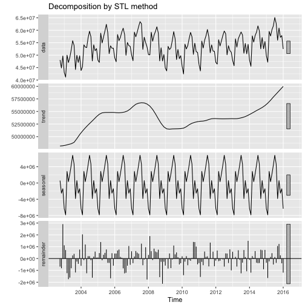
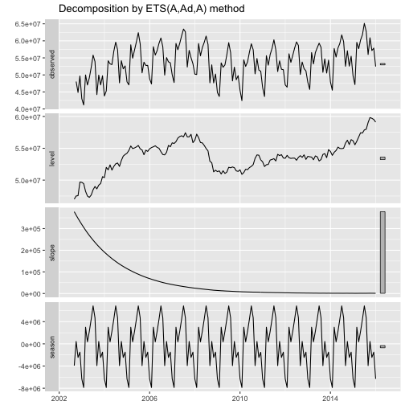
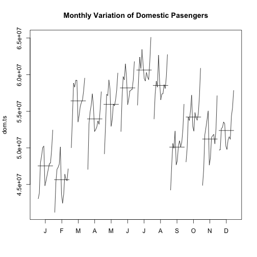
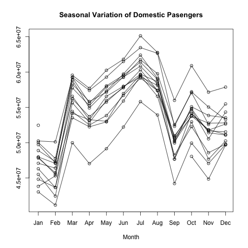
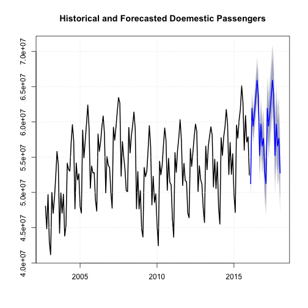

## Introduction

In these notes we demonstrate how to forecast Time Series with R


```r
rm(list=ls()) #rm(list of objects) removes all objects from memory
graphics.off() #Closign all previously open graphs
```

## I. Airline Example
In this example we forecast domestic airline passengers.

Loading data into R:

```r
library(foreign)
airline <- read.csv("AirlineData.csv")
```

**Data source:**
  
  U.S. Department of Transportation

Bureau of Transportation Statistics

URL: http://www.transtats.bts.gov/Data_Elements.aspx?Data=1

**Variable Description:**
  
  Year       - Year

Month      - Month

dom.pass   - number of passengers on domestic flights

int.pass   - number of passengers on international flights

total.pass - number of passengers on all flights


**Removing observations that have TOTAL in Month**

```r
airline <- subset(airline, airline$Month != "TOTAL") 
```

**Need to install the forecast package**

```r
#install.packages("forecast") #Need to do this only once
library(forecast)
```

**Creating a time series object from dom.pass**

```r
dom.ts <- ts(airline$dom.pass, start=c(2002, 10), frequency=12)
```

**Plotting the time series**

```r
plot(dom.ts, main="Time Series of Domestic Pasengers",
     type="lines", xlab="Time", ylab="# of Passengers on domestic flights",
     col="blue", lty=1, lwd=2)
grid()
```



Seems like a structural break between 2008 - 2010. There seems to be an upward trend prior to 2008. Then around 2009 there was a sharp fall, and a new trend started in 2010.

A time series with additive trend, seasonal, and irregular components can be decomposed using the stl() function from base R, or ets() function from "forecast" package.

**Decomposing with stl()**

```r
fit1 <- stl(dom.ts, s.window="periodic")
library(ggplot2)
autoplot(fit1, main="Decomposition by STL method")
```



**Decomposing with ets()**

```r
fit2 <- ets(dom.ts)
library(ggplot2)
autoplot(fit2)
```



**Plotting monthly variation**

```r
monthplot(dom.ts, main="Monthly Variation of Domestic Pasengers")
```



**Plotting seasonal componnent**

```r
seasonplot(dom.ts, main="Seasonal Variation of Domestic Pasengers") 
```



**Forecasting the time series**

```r
n <- 24 #We will generate forecast for n periods into the future
f1 <- forecast(fit1,h=n) #Based on stl()
f1
```

```
##          Point Forecast    Lo 80    Hi 80    Lo 95    Hi 95
## Feb 2016       51241074 49933297 52548851 49241001 53241147
## Mar 2016       61939819 60437337 63442302 59641971 64237668
## Apr 2016       59412185 57737483 61086886 56850950 61973420
## May 2016       61326397 59495606 63157189 58526443 64126351
## Jun 2016       63521871 61547290 65496452 60502010 66541732
## Jul 2016       65907529 63798942 68016117 62682723 69132336
## Aug 2016       63746959 61512386 65981531 60329475 67164442
## Sep 2016       55239247 52885423 57593070 51639384 58839109
## Oct 2016       59678145 57210827 62145463 55904708 63451583
## Nov 2016       56585227 54009410 59161043 52645856 60524598
## Dec 2016       57670724 54990799 60350650 53572132 61769317
## Jan 2017       52755045 49974905 55535184 48503189 57006901
## Feb 2017       51241074 48364210 54117938 46841290 55640858
## Mar 2017       61939819 58969379 64910260 57396922 66482717
## Apr 2017       59412185 56351026 62473343 54730547 64093822
## May 2017       61326397 58177134 64475661 56510014 66142781
## Jun 2017       63521871 60286900 66756841 58574410 68469331
## Jul 2017       65907529 62589065 69225994 60832376 70982683
## Aug 2017       63746959 60347050 67146867 58547247 68946670
## Sep 2017       55239247 51759800 58718693 49917892 60560601
## Oct 2017       59678145 56120938 63235352 54237867 65118424
## Nov 2017       56585227 52951923 60218530 51028569 62141885
## Dec 2017       57670724 53962886 61378563 52000075 63341374
## Jan 2018       52755045 48974140 56535949 46972650 58537439
```

```r
f2 <- forecast(fit2,h=n) #Based on ets()
f2
```

```
##          Point Forecast    Lo 80    Hi 80    Lo 95    Hi 95
## Feb 2016       51244962 49944787 52545137 49256516 53233408
## Mar 2016       62107812 60624944 63590679 59839962 64375662
## Apr 2016       59480407 57834958 61125856 56963910 61996904
## May 2016       61378437 59585041 63171832 58635674 64121199
## Jun 2016       63572613 61642539 65502687 60620819 66524407
## Jul 2016       65959168 63901438 68016897 62812142 69106193
## Aug 2016       63816457 61638510 65994404 60485574 67147340
## Sep 2016       55194359 52902462 57486256 51689205 58699513
## Oct 2016       59551827 57151357 61952297 55880625 63223030
## Nov 2016       56667685 54163319 59172050 52837588 60497781
## Dec 2016       57620287 55016145 60224428 53637596 61602978
## Jan 2017       52811894 50111600 55512188 48682151 56941637
## Feb 2017       51254097 48460977 54047216 46982389 55525804
## Mar 2017       62116565 59233590 64999541 57707435 66525696
## Apr 2017       59488796 56518665 62458927 54946372 64031220
## May 2017       61386476 58331659 64441293 56714536 66058415
## Jun 2017       63580317 60443085 66717549 58782334 68378300
## Jul 2017       65966551 62749000 69184102 61045732 70887370
## Aug 2017       63823532 60527607 67119458 58782850 68864215
## Sep 2017       55201140 51828649 58573630 50043360 60358919
## Oct 2017       59558325 56110958 63005692 54286032 64830618
## Nov 2017       56673912 53153249 60194574 51289523 62058300
## Dec 2017       57626254 54033782 61218727 52132042 63120466
## Jan 2018       52817613 49154700 56480526 47215671 58419555
```

The forecasts are very similar. We choose to plot and save the ets() forecast.


```r
f <- f1
```

**Plotting forecasted time series**

```r
plot(f, lwd=2, main="Historical and Forecasted Doemestic Passengers")
grid()
```



**Saving the forecasted data**

```r
forecast_data <- data.frame(date=as.Date(time(f$mean)), p_low = as.matrix(f$lower[1:n,2]), 
                            p_mean=as.matrix(f$mean), p_upper=as.matrix(f$upper[1:n,2]))
write.csv(forecast_data, file = "forecast.csv", row.names = F) #Saves dataset in CVS format
```


