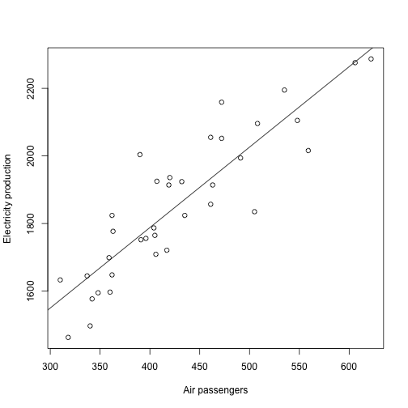

  
  

##Multiple time series
Here we illustrate a few important ideas and concepts related to multiple time series data. The monthly supply of electricity (millions of kWh), beer (Ml),
and chocolate-based production (tonnes) in Australia over the period January
1958 to December 1990 are available from the Australian Bureau of Statistics
(ABS). The three series have been stored in a single file online, which can be
read as follows:


```r
CBE<-read.table("cbe.dat", header=TRUE)
CBE[1:4,]
```

```
##   choc beer elec
## 1 1451 96.3 1497
## 2 2037 84.4 1463
## 3 2477 91.2 1648
## 4 2785 81.9 1595
```

```r
class(CBE)
```

```
## [1] "data.frame"
```
Now create time series objects for the electricity, beer, and chocolate data.
If you omit end, R uses the full length of the vector, and if you omit the month
in start, R assumes 1. You can use **plot** with cbind to plot several series


```r
Elec.ts<-ts(CBE[,3],start=1958, freq=12)
Beer.ts<-ts(CBE[,2],start=1958, freq=12)
Choc.ts<-ts(CBE[,1],start=1958, freq=12)
#You can use 'plot' with 'cbind' to plot several series on one figure!
plot(cbind(Elec.ts, Beer.ts, Choc.ts)) # Fig. 1.5.
```


The plots show increasing trends in production for all three
goods, partly due to the rising population in Australia from about 10 million
to about 18 million over the same period. But notice that electricity
production has risen by a factor of 7, and chocolate production by a factor of
4, over this period during which the population has not quite doubled.

## multiple time series
The three series constitute a multiple time series. There are many functions
in R for handling more than one series, including **ts.intersect** to obtain the
intersection of two series that overlap in time. We now illustrate the use of the
intersect function and point out some potential pitfalls in analysing multiple
time series. The intersection between the air passenger data and the electricity
data is obtained as follows:

```r
#the 'ts.intersect' function for obtaining intersections of two series that overlap in time
data("AirPassengers")
AP <- AirPassengers
AP.elec<-ts.intersect(AP, Elec.ts)
start(AP.elec)
```

```
## [1] 1958    1
```

```r
end(AP.elec)
```

```
## [1] 1960   12
```

```r
AP.elec[1:3,]
```

```
##       AP Elec.ts
## [1,] 340    1497
## [2,] 318    1463
## [3,] 362    1648
```
In the code below, the data for each series are extracted and plotted

```r
#The data for each series is extracted and plotted
AP<-AP.elec[,1];Elec<-AP.elec[,2]
layout(1:2)
plot(AP, main="", ylab="Air passengers / 1000's") # Fig. 1.7. (oben)
plot(Elec, main="", ylab="Electricity porduction / MkWh") # Fig. 1.7 (unten)
```


```r
plot(as.vector(AP), as.vector(Elec), xlab="Air passengers", #as.vector is needed to convert "ts" objects to ordinary vectors needed for scatterplot
     ylab="Electricity production") # Fig. 1.8.
abline(reg=lm(Elec~AP)) #Linear model trend line
```



```r
cor(AP, Elec) #Correlation coefficient => CORRELATION DOES NOT IMPLY CAUSATION!!! This is a good example for that!
```

```
## [1] 0.8841668
```


## Interpretation
   - The two time series are highly correlated, as can be seen in the plots, with a
correlation coefficient of 0.88. 
   - The two time plots look similar  and
that the scatter plot shows an approximate linear association between the two
variables. 
   - However, it is important to realise that correlation does
not imply causation. 
   - In this case, it is not plausible that higher numbers of
air passengers in the United States cause, or are caused by, higher electricity
production in Australia. 
   - A reasonable explanation for the correlation is that
the increasing prosperity and technological development in both countries over
this period accounts for the increasing trends. 
   - The two time series also happen
to have similar seasonal variations. For these reasons, it is usually appropriate
to remove trends and seasonal effects before comparing multiple series. This
is often achieved by working with the residuals of a regression model that has
deterministic terms to represent the trend and seasonal effects.

