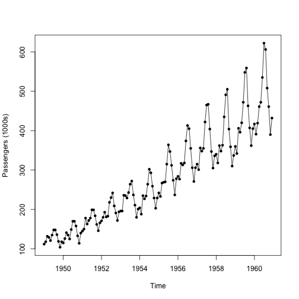
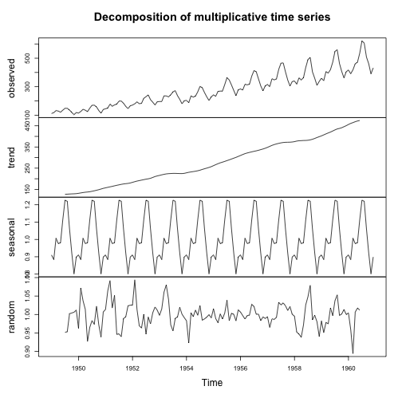
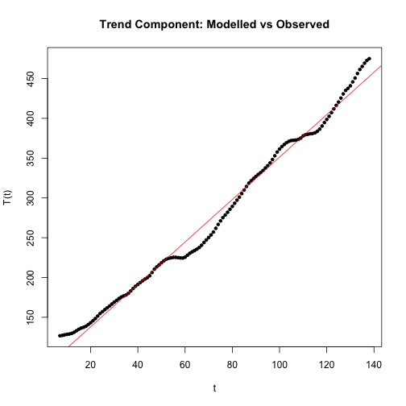
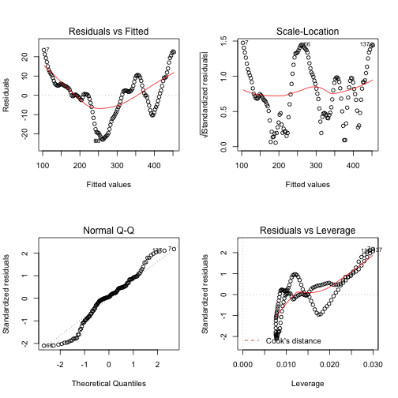
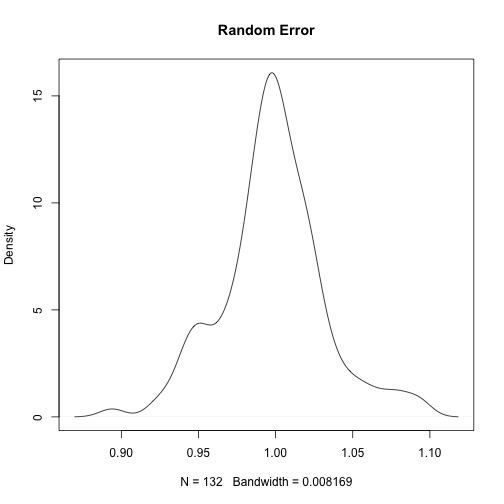
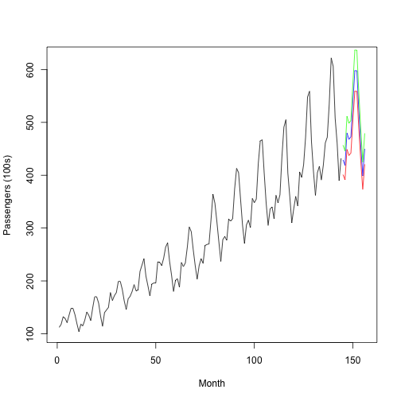

## Introduction
Here I analyse the R dataset of monthly totals of international airline passengers between 1949 to 1960 and apply a simple model to forecast 3-point estimates for 1961’s monthly totals. ARMA/ARIMA models will not be considered in this analysis.


## Load Data & Plot
Loading dataset AirPassengers into R’s workspace and assigning it to AP (for convenience):


```r
data("AirPassengers")
AP <- AirPassengers
```
Time-series plot:


```r
plot(AP, ylab="Passengers (1000s)", type="o", pch =20)
```




Seasonality appears to increase with the general trend suggesting a multiplicative model rather than an additive model, i.e:

$$Y(t)=T(t)∗S(t)∗e(t)$$

where,
- $Y(t)$ is the number of passengers at time t
- $T(t)$ is the trend component at time t
- $S(t)$ is the seasonal component at time t
- $e(t)$ is the random error component at time t

## Decomposing the Data
Decomposing the data into its trend, seasonal, and random error components will give some idea how these components relate to the observed dataset.


```r
AP.decompM <- decompose(AP, type = "multiplicative")
plot(AP.decompM)
```



## Model Fitting

### Trend Component

Inspecting the trend component in the decomposition plot suggests that the relationship is linear, thus fitting a linear model:


```r
t <- seq(1, 144, 1)
modelTrend <- lm(formula = AP.decompM$trend ~ t)
predT <- predict.lm(modelTrend, newdata = data.frame(t))

plot(AP.decompM$trend[7:138] ~ t[7:138], ylab="T(t)", xlab="t",
     type="p", pch=20, main = "Trend Component: Modelled vs Observed")
lines(predT, col="red")
```




```r
layout(matrix(c(1,2,3,4),2,2))
plot(modelTrend)
```



```r
summary(modelTrend)
```

```
## 
## Call:
## lm(formula = AP.decompM$trend ~ t)
## 
## Residuals:
##      Min       1Q   Median       3Q      Max 
## -22.9162  -6.0845   0.6094   5.8658  23.4748 
## 
## Coefficients:
##             Estimate Std. Error t value Pr(>|t|)    
## (Intercept) 84.64827    2.05100   41.27   <2e-16 ***
## t            2.66694    0.02504  106.50   <2e-16 ***
## ---
## Signif. codes:  0 '***' 0.001 '**' 0.01 '*' 0.05 '.' 0.1 ' ' 1
## 
## Residual standard error: 10.96 on 130 degrees of freedom
##   (12 observations deleted due to missingness)
## Multiple R-squared:  0.9887,	Adjusted R-squared:  0.9886 
## F-statistic: 1.134e+04 on 1 and 130 DF,  p-value: < 2.2e-16
```

Therefore, the relationship between trend and time can be expressed as:
$$\widehat{T(t)}=2.666t+84.648$$
And so for 1961 (time 145 to 156 inc.), the trend component (T) is:


```r
Data1961 <- data.frame("T" = 2.667*seq(145, 156, 1) + 84.648, S=rep(0,12), e=rep(0,12),
                       row.names = c("Jan", "Feb", "Mar", "Apr", "May", "Jun", "Jul", "Aug", "Sep", "Oct", "Nov", "Dec"))
Data1961
```

```
##           T S e
## Jan 471.363 0 0
## Feb 474.030 0 0
## Mar 476.697 0 0
## Apr 479.364 0 0
## May 482.031 0 0
## Jun 484.698 0 0
## Jul 487.365 0 0
## Aug 490.032 0 0
## Sep 492.699 0 0
## Oct 495.366 0 0
## Nov 498.033 0 0
## Dec 500.700 0 0
```

## Seasonal Component
Inspecting the seasonal (S) component of the decomposition reveals:


```r
AP.decompM$seasonal
```

```
##            Jan       Feb       Mar       Apr       May       Jun       Jul
## 1949 0.9102304 0.8836253 1.0073663 0.9759060 0.9813780 1.1127758 1.2265555
## 1950 0.9102304 0.8836253 1.0073663 0.9759060 0.9813780 1.1127758 1.2265555
## 1951 0.9102304 0.8836253 1.0073663 0.9759060 0.9813780 1.1127758 1.2265555
## 1952 0.9102304 0.8836253 1.0073663 0.9759060 0.9813780 1.1127758 1.2265555
## 1953 0.9102304 0.8836253 1.0073663 0.9759060 0.9813780 1.1127758 1.2265555
## 1954 0.9102304 0.8836253 1.0073663 0.9759060 0.9813780 1.1127758 1.2265555
## 1955 0.9102304 0.8836253 1.0073663 0.9759060 0.9813780 1.1127758 1.2265555
## 1956 0.9102304 0.8836253 1.0073663 0.9759060 0.9813780 1.1127758 1.2265555
## 1957 0.9102304 0.8836253 1.0073663 0.9759060 0.9813780 1.1127758 1.2265555
## 1958 0.9102304 0.8836253 1.0073663 0.9759060 0.9813780 1.1127758 1.2265555
## 1959 0.9102304 0.8836253 1.0073663 0.9759060 0.9813780 1.1127758 1.2265555
## 1960 0.9102304 0.8836253 1.0073663 0.9759060 0.9813780 1.1127758 1.2265555
##            Aug       Sep       Oct       Nov       Dec
## 1949 1.2199110 1.0604919 0.9217572 0.8011781 0.8988244
## 1950 1.2199110 1.0604919 0.9217572 0.8011781 0.8988244
## 1951 1.2199110 1.0604919 0.9217572 0.8011781 0.8988244
## 1952 1.2199110 1.0604919 0.9217572 0.8011781 0.8988244
## 1953 1.2199110 1.0604919 0.9217572 0.8011781 0.8988244
## 1954 1.2199110 1.0604919 0.9217572 0.8011781 0.8988244
## 1955 1.2199110 1.0604919 0.9217572 0.8011781 0.8988244
## 1956 1.2199110 1.0604919 0.9217572 0.8011781 0.8988244
## 1957 1.2199110 1.0604919 0.9217572 0.8011781 0.8988244
## 1958 1.2199110 1.0604919 0.9217572 0.8011781 0.8988244
## 1959 1.2199110 1.0604919 0.9217572 0.8011781 0.8988244
## 1960 1.2199110 1.0604919 0.9217572 0.8011781 0.8988244
```

Thus the seasonal (S) component to the new 1961 dataset is:


```r
Data1961$S <- unique(AP.decompM$seasonal)
Data1961
```

```
##           T         S e
## Jan 471.363 0.9102304 0
## Feb 474.030 0.8836253 0
## Mar 476.697 1.0073663 0
## Apr 479.364 0.9759060 0
## May 482.031 0.9813780 0
## Jun 484.698 1.1127758 0
## Jul 487.365 1.2265555 0
## Aug 490.032 1.2199110 0
## Sep 492.699 1.0604919 0
## Oct 495.366 0.9217572 0
## Nov 498.033 0.8011781 0
## Dec 500.700 0.8988244 0
```

## Random Error Component
Ploting the density estimation of the random error (e) component of the decomposition shows an approximate normal distribution:


```r
plot(density(AP.decompM$random[7:138]),
             main="Random Error") #Values 1:6 & 139:44 are NA
```



Bootstrapping the mean statistic of the random error would produce an accurate approximation of the population mean of the randon error. However, I believe this is too costly for the reward it gives and thus I shall assume the population mean of the random error is:


```r
mean(AP.decompM$random[7:138])
```

```
## [1] 0.9982357
```

which is 1.

Thus the decomposed dataset for 1961 is:

```r
Data1961$e <- 1
Data1961
```

```
##           T         S e
## Jan 471.363 0.9102304 1
## Feb 474.030 0.8836253 1
## Mar 476.697 1.0073663 1
## Apr 479.364 0.9759060 1
## May 482.031 0.9813780 1
## Jun 484.698 1.1127758 1
## Jul 487.365 1.2265555 1
## Aug 490.032 1.2199110 1
## Sep 492.699 1.0604919 1
## Oct 495.366 0.9217572 1
## Nov 498.033 0.8011781 1
## Dec 500.700 0.8988244 1
```

## Predictions (1961)

For my 1961 3-point estimates for each month, I assume that all variation is due to the random error (for simplicity) and so taking the standard deviation of the random error distribution gives:


```r
sd_error <- sd(AP.decompM$random[7:138])
sd_error
```

```
## [1] 0.0333884
```

And so the 3-point esitmates (Realistic, Optimistic, Pessimistic) for the predictions is simply the expected prediction (T∗S∗e), and 95$\%$ CI interval either way using the standard deviation of the random error (95$\%$ CI = 1.95$\times$sd


```r
Data1961$R <- Data1961$T * Data1961$S * Data1961$e                  #Realistic Estimation
Data1961$O <- Data1961$T * Data1961$S * (Data1961$e+1.95*sd_error)  #Optimistic Estimation
Data1961$P <- Data1961$T * Data1961$S * (Data1961$e-1.95*sd_error)  #Pessimistic Estimation
Data1961
```

```
##           T         S e        R        O        P
## Jan 471.363 0.9102304 1 429.0489 456.9832 401.1147
## Feb 474.030 0.8836253 1 418.8649 446.1361 391.5937
## Mar 476.697 1.0073663 1 480.2085 511.4736 448.9434
## Apr 479.364 0.9759060 1 467.8142 498.2724 437.3561
## May 482.031 0.9813780 1 473.0546 503.8540 442.2553
## Jun 484.698 1.1127758 1 539.3602 574.4765 504.2439
## Jul 487.365 1.2265555 1 597.7802 636.7001 558.8603
## Aug 490.032 1.2199110 1 597.7954 636.7163 558.8745
## Sep 492.699 1.0604919 1 522.5033 556.5221 488.4845
## Oct 495.366 0.9217572 1 456.6072 486.3357 426.8787
## Nov 498.033 0.8011781 1 399.0131 424.9918 373.0344
## Dec 500.700 0.8988244 1 450.0414 479.3424 420.7404
```

Graphically:


```r
xr = c(1,156)
plot(AP.decompM$x, xlim=xr, ylab = "Passengers (100s)", xlab = "Month")
lines(data.frame(AP.decompM$x))
lines(Data1961$R, x=seq(145,156,1), col="blue")
lines(Data1961$O, x=seq(145,156,1), col="green")
lines(Data1961$P, x=seq(145,156,1), col="red")
```



## Conclusions
The realistic estimations for 1961 are less than 1960 data. This is because the linear regression modelling the trend component under-estimates the trend component towards the end of the observable dataset (see figure above). A piecewise regression or swicting to an ARMA/ARIMA model would give better predictions.

## Further Considerations
ARMA/ARIMA model. Model validation (in this analysis, test set = training set and thus no model validation has taken place).


